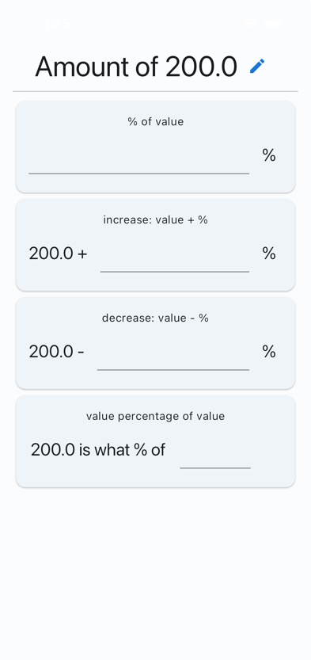

# Percentage Tools

**Percentage calculations made easy!**
--------

### _Features_

#### Percentage calculations:
  - [x] percentage of value;
  - [x] increase percentage of value;
  - [x] decrease percentage of value;
  - [x] percentage of a value over another value;

-> 

#### Graphs
  - [ ] Crate a new Label defining Name, value, category and color
  - [ ] See the separation in graphs
#### What percentage of your salary does it cost?

### _Technical_

- Flutter Mobile App
- _RiverPod_ state management.
  - Flutter hooks
- Custom lints

#### Missing implementations:

- [ ] Unit tests
- [ ] Integration tests
- [ ] Improve UI / UX